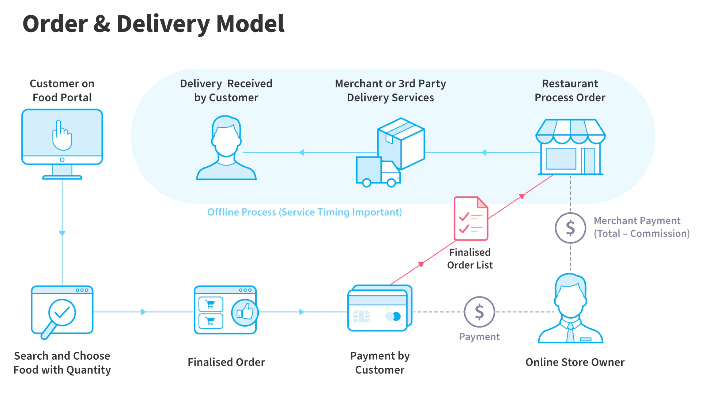
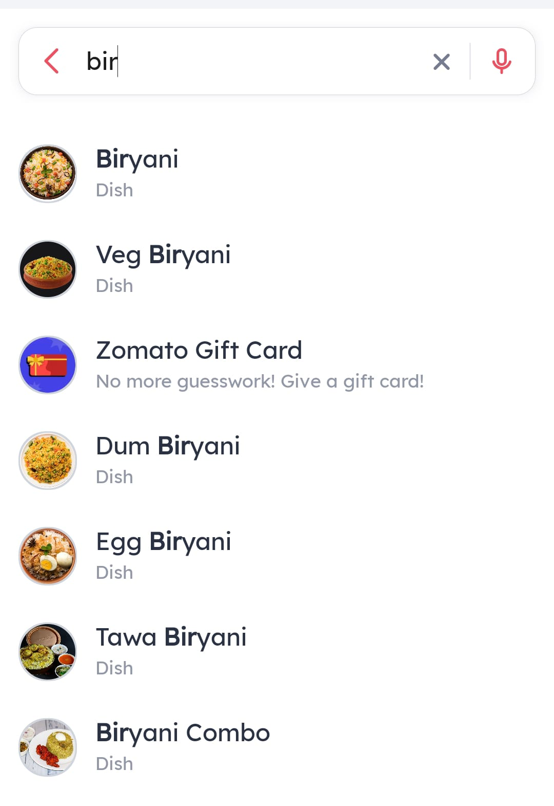
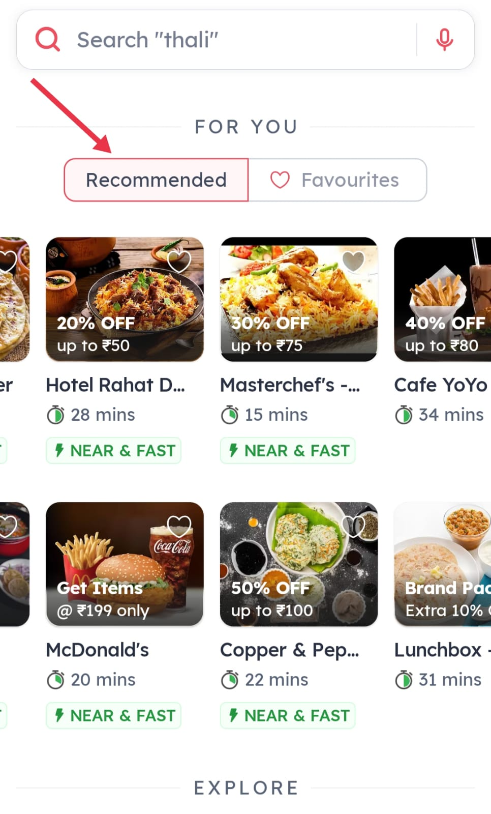
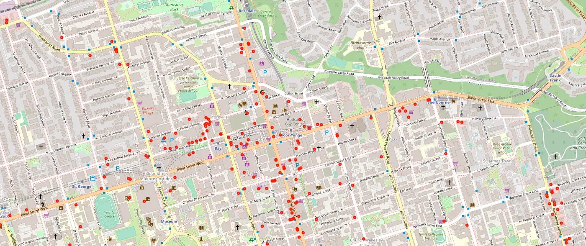
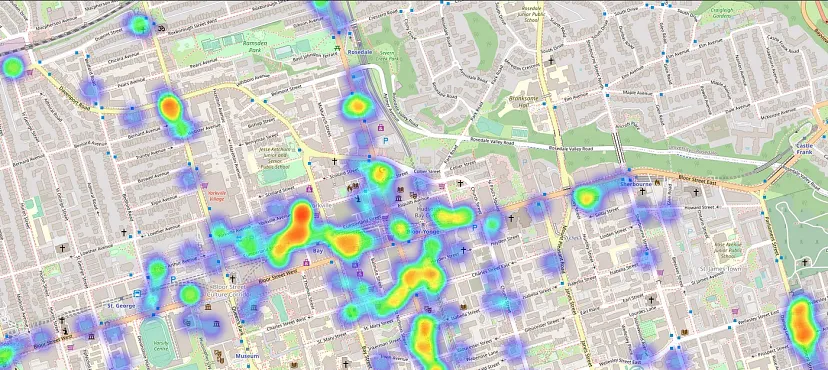

# FOOD DELIVERY Portfolio

# APS portfolio on Food delivery application
 - **Course Name:** Algorithmic Problem Solving
 - **Course Code:** 23ECSE309
 - **Name:** Shubam patil
 - **University:** KLE Technological University, Hubballi-31

---

# Overview
This portfolio explores and analyzes food delivery app functionalities, emphasizing the algorithms and data structures that enhance efficiency, including payment processing, route optimization, and personalized recommendations.

---

# Table of contents
1. [Introduction](#introduction)
2. [Objectives](#objectives)
3. [System design](#system-design)
4. [Functionalities](#functionalities)
5. [Efficiency analysis](#efficiency-analysis)
6. [References](#references)

---

# Introduction
Food delivery applications have changed how people order food, becoming very popular with the rise of smartphones and the internet. Their convenience and variety have made them essential in a short time, which is good for business but presents engineering challenges. Using the right components is crucial for maintaining efficient and scalable services.

Key to this efficiency are the algorithms that power these services. At the core, any code implementing business logic—such as order processing, route optimization, payments, and recommendations—depends on well-defined algorithms. Thus, choosing the right algorithms and data structures is critical as they are the backbone of the service.

---

# Objectives
- Explore new algorithms in the field of food delivery services.
- Suggest suitable algorithms and optimizations.
- Provide detailed explanations and modifications to existing algorithms.
- Try and implement various algorithms and data structures as they are the core of any robust delivery system.

---

# System Design

- System Architecture Overview:
1. Microservices Architecture:
   -Purpose: Divide the application into independent services for scalability and maintainability.
   -Components: Services include Order Management, Payment Processing, Delivery Routing, User Authentication, Menu Management, and Notification Services.
2. Orchestrators and Proxies:
   -Purpose: Coordinate and manage interactions between microservices.
   -Implementation: Utilize Kubernetes for container orchestration and NGINX as a reverse proxy for routing and load balancing.
3. Pub-Sub Mechanism:
   -Purpose: Facilitate asynchronous communication between services.
   -Implementation: Use Kafka or RabbitMQ for event-driven architecture, enabling real-time updates and notifications.
4. Key Users:
   -Customer: Places orders, tracks delivery, and provides feedback.
   -Restaurant: Manages menu items, updates availability, and receives orders.
   -Delivery Driver: Accepts delivery requests, navigates using optimized routes, and updates order status.

---

# Functionalities
1. **Fenwick Trees (Binary Indexed Trees)**
    - Use Case: Efficiently manage and query prefix sums.
    - Application:
          Customer Spending Tracking: Maintain and query the total spending of customers over time to offer personalized discounts or loyalty rewards.
          Order Statistics: Quickly compute cumulative statistics like the total number of orders or the total revenue generated in a specific time period.
    - Code: [Fenwick Tree](https://github.com/shubam14dec/shubam14dec.github.io/blob/main/codes/Fenwick_trees.cpp)
2. **Typeahead search**
Typeahead search refers to the functionality where the user types part of the query they are intending to search for (e.g., restaurant name, dish name, or cuisine), and a list of potential matches is prompted back to the user to choose from.

    - Data Structure:
Trie: A popular data structure used to efficiently store and retrieve keys in a dataset of strings. It's particularly useful for dictionary-like functionalities, such as autocomplete or typeahead search.
    - Algorithms:
Trie Traversal with BFS/DFS: Algorithms like Breadth-First Search (BFS) or Depth-First Search (DFS) can be utilized to find the k-nearest words or matches based on the user’s input.
    - Code : [DFS](https://github.com/shubam14dec/shubam14dec.github.io/blob/main/codes/dfs.cpp)
    - Code : [BFS](https://github.com/shubam14dec/shubam14dec.github.io/blob/main/codes/bfs.cpp)

      
3. **Trie Data Structure**
    - Use Case: Efficient retrieval of strings.
    - Application:
        1. Typeahead Search: Implement autocomplete functionality for search queries (e.g., restaurant names, dish names, cuisines).
        2. Menu Search: Allow users to quickly find dishes or restaurants by typing partial names.
    - Code : [Trie](https://github.com/shubam14dec/shubam14dec.github.io/blob/main/codes/trie.cpp)

4. **Efficient Navigation**
     - Breadth-First Search (BFS) and Depth-First Search (DFS)
     - Use Case: Traverse or search tree or graph data structures.
     - Application:
        1. Map Navigation: Provide accurate and efficient navigation within the application's map feature.
        2. Recommendation System: Traverse user preference graphs to suggest similar restaurants or dishes.
     - Code: [kruskal](https://github.com/shubam14dec/shubam14dec.github.io/blob/main/codes/kruskal.cpp)
5. **Personalised recommendation system**
  - Recommendation System
  - Functionality: Providing personalized food recommendations based on user preferences and past orders.
  - Key Algorithms:
    1. Content-Based Filtering: To recommend items based on item attributes and user preferences.
    2. BFS/DFS: To traverse user preference graphs.
    

6. **Ant Colony Optimization**
  - Food Delivery Optimization using Ant Colony Optimization (ACO),” was born out of a need to enhance the efficiency and effectiveness of food delivery services in densely populated urban areas. The project was driven by the overarching goal of improving customer satisfaction through timely deliveries while also maximizing corporate profitability and driver efficiency.

 **Points of Interest (POIs)**
  - Focusing on food delivery, we’re keen to understand the distribution of cafes and restaurants within the Bloor-Yonge area. By leveraging the overpass API, we can query OpenStreetMap to fetch a comprehensive list of these entities, all within a 2km radius of our map's center. This compilation will constitute our POI map. In the map below, red dots represent the location of either a cafe or a restaurant.
 

 **Heat Map**
  - Building on our POI map, we can explore deeper into the locations of cafes and restaurants using a heat map. This visualization enables us to pinpoint areas with a higher concentration of these establishments.
 

 **Problem formulation**
   - Let G = (N, A) be a graph where N is the set of nodes including the business circle and customer locations and A is the set of arcs representing possible paths between nodes.
   - Each node i ∈ N has a demand q_i, the number of food items to be delivered, and a time window [a_i, b_i] within which the delivery must occur.
   - Each arc (i, j) A has an associated travel time t_ij and distance d_ij.
   - The objective is to minimize the total distance travelled by all couriers.

7. **Union-Find (Disjoint Set Union)**
    
- Use Case: Keep track of a partition of a set into disjoint subsets.
- Application:
    1. Cluster Management: Manage clusters of users or delivery zones efficiently.
    2. Coupon Distribution: Track which users belong to specific promotional groups to avoid redundancy and ensure fair distribution.
- Code : [Union_find](https://github.com/shubam14dec/shubam14dec.github.io/blob/main/codes/union_find.cpp)
  
---

# Efficiency analysis

|---------------------------------------|------------------------------------------------|-----------------------------------------------|
| **Algorithm**                         | **Time Complexity**                            | **Space Complexity**                          |
|---------------------------------------|------------------------------------------------|-----------------------------------------------|
| **Fenwick Trees**                     | Creation: O(n log n), Update/Query: O(log n)   | O(n)                                          |
| **Dijkstra's Algorithm**              | O((V + E) log V)                               | O(V^2)                                        |
| **Trie Data Structure**               | Insert/Search: O(n)                            | O(n) each node                                |
| **Segment Trees**                     | Creation: O(n log n), Query/Update: O(log n)   | O(n)                                          |
| **Hash Tables**                       | Insert/Delete/Search: theta(1), O(n)           | O(n)                                          |
| **BFS and DFS**                       | O(V + E)                                       | O(V)                                          |
| **Binary Search Tree**                | Insert/Delete/Search: theta(log n), O(n)       | O(n)                                          |
| **Kruskal's Algorithm**               | O(E log E)                                     | O(E + V)                                      |
| **Union-Find**                        | Union/Find: O(α(n))                            | O(n)                                          |
|---------------------------------------|------------------------------------------------|-----------------------------------------------|

---

# References
[1]  "Crowdsourced on-demand food delivery: An order batching and assignment algorithm" Available: [https://www.sciencedirect.com/science/article/pii/S0968090X2300044X](https://www.sciencedirect.com/science/article/pii/S0968090X2300044X)

[2]  "HOW DOES THE FOOD DELIVERY APPS ALGORITHM WORK?" Available:([https://systemdesignschool.io/problems/typeahead/solution](https://www.deliverect.com/en/blog/online-food-delivery/how-does-food-delivery-apps-algorithm-work))

[3]  "Optimizing Delivery Routes: Zomato’s Algorithm-Driven Approach" Available: [https://medium.com/@yadnesh.pathak21/optimizing-delivery-routes-zomatos-algorithm-driven-approach-f15bc46d4538](https://medium.com/@yadnesh.pathak21/optimizing-delivery-routes-zomatos-algorithm-driven-approach-f15bc46d4538)

[4]  "Optimizing Food Delivery Routes with Ant Colony Optimization" Available: [https://medium.com/ai4sm/food-delivery-optimization-using-ant-colony-optimization-05aefff3077e](https://medium.com/ai4sm/food-delivery-optimization-using-ant-colony-optimization-05aefff3077e)
